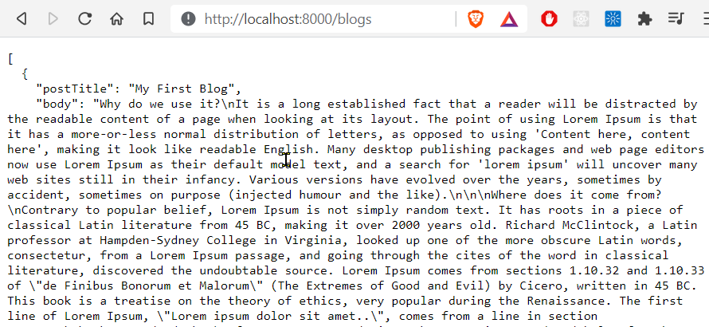

[](https://github.com/rbhachu/JSON-Server-Heroku-HK) [](https://github.com/rbhachu/JSON-Server-Heroku-HK)


<h1 align="center">JSON Server + House Keeping<br>(Back-End API REST Server for The Mojo Blog)</h1>
<br>


## Description
<p>Updated version of JSON Server (https://github.com/rbhachu/JSON-Server-Heroku) with House Keeping feature added to ensure db.json file is reset every night using Heroku Scheduler Plugin.
</p><br>


## Dependencies/NPM Modules
[JSON Server v0.16.3 *](https://www.npmjs.com/package/json-server) - Creates a JSON REST API Server
[Nodemon v2.0.7 *](https://www.npmjs.com/package/nodemon) - Automatically restarts node application when file changes detected
<i>
* Installed automatically<br>
</i>
<br><br>


---

## Installation 
<p>Open your Code Editor and 'CD' into your working directory, then download the repo to that location, by executing the following command in your terminal.<p>

```sh
git clone https://github.com/rbhachu/JSON-Server-Heroku-HK.git
```

<p>Once the repo has been downloaded, 'CD' to the newly downloaded project folder. Then execute the following command in your terminal.<p>

```sh
npm install
```

<p>Also check for any updates by running the following command too.<p>

```sh
npm update
```
<br>


## Deployment
<p>Finally, to run the JSON server simply execute the following command in your terminal (ensuring you are in the correct project directory too).</p>

```sh
npm start
```

<p>After a few seconds, your browser should automatically open to the following link; 

[http://localhost:8000](http://localhost:8000) and display the following `Success` message in the browser page too.</p>


<br><br>

<p>You can also review the test db.json file data by clicking on the following links;<br>

**All Data:** http://localhost:8000/blogs<br>
**Data for ID 1:** http://localhost:8000/blogs/1<br>
**Data for ID 2:** http://localhost:8000/blogs/2
</p>


<br><br>


## Issues
If you encounter issues, please drop me a message via LinkedIn and I will try to help you resolve the issue.
<br><br>


## Author
👤 **Rishi Singh Bhachu**<br>
Contact me via [LinkedIn](https://www.linkedin.com/in/rishisinghbhachu/)
<br><br>


## Show your support
If you liked this project it would be greatly appreciated to show your support by simply giving this repo a ⭐️ rating too, many thanks!